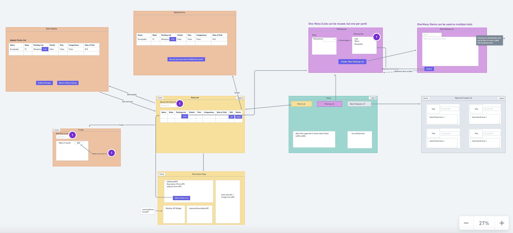
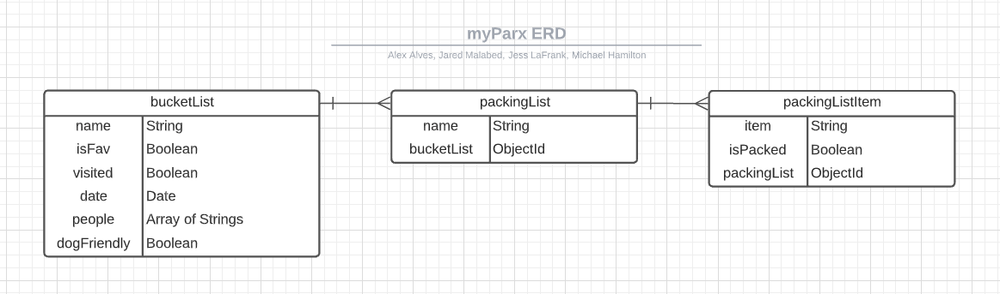

# General Assembly Project 2: MyParx FrontEnd

## Team: Alex Alves, Jared Malabed, Jess LaFrank, Michael Hamilton

### Summary

myParx is an app to help users create a Bucket List of US National Parks to visit. Additionally, users can create Packing Lists and associate them with a favorited national park. For example, if a user is going to Yosemite for 2 days, and has previously created a Packing List for a 2-day camping trip, they can associate that packing list with their favorite park. So simple! What a time save.

A searchbar lets Users can search the National Park Service's database of all parks, and easily add a park to their Favorites list from the search result screen.

This project was created over the course of 5 days as part of the General Assembly Software Engineering Immersive in Summer/Fall 2021.

### Index

- [Heading Name](#heading-name)

### Technologies

- MERN Stack: Mongo, Express, React, and Node
- HTML, CSS, JavaScript
- Deployed to Heroku and Surge
- React-bootstrap
- dotenv

## User Stories

- User can search NPS database for parks to visit
- User can see names, states, descriptions of parks in search results
- User can add parks to their Favorites List
- User can plan visit by inputting dates to visit park
- User can store multiple packing lists
- User can associate a specific stored packing list with a Park
- User can add, update, and remove items on specific packing lists
- User can keep track of parks they've visited
- User can add People and Pets to bring to favorite park

### Main Objectives

- Streamline the process of traveling to and packing for national park visits
- An API of your own design (built using Node, Express, and Mongoose) that serves JSON.
- A front-end React application that updates the UI and makes requests to the API.
- use either CSS Grid or Flexbox along with media queries to make your app responsive

### Stretch Goals

- Create model associations

## Link to App

- tbd

## Site Graphics

### Sitemap

### Wireframes

[Link to full size wireframe](https://whimsical.com/home-K1VyMcAYTo89J4iYfbWTyg)

### Entity Relationship Diagram

## Minimum Viable Product

## Future Work
